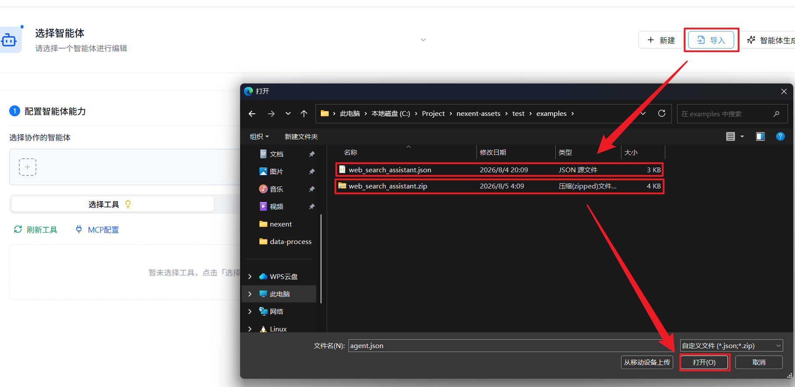
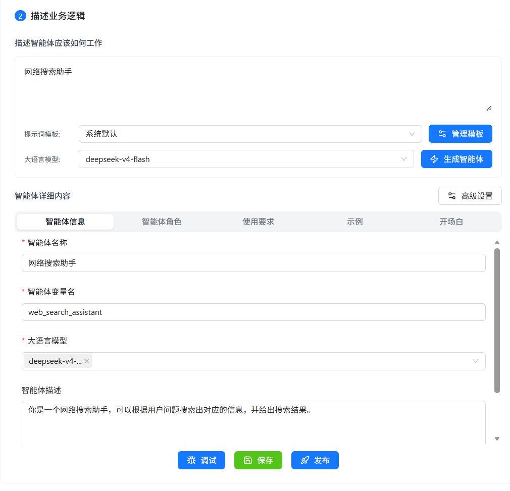
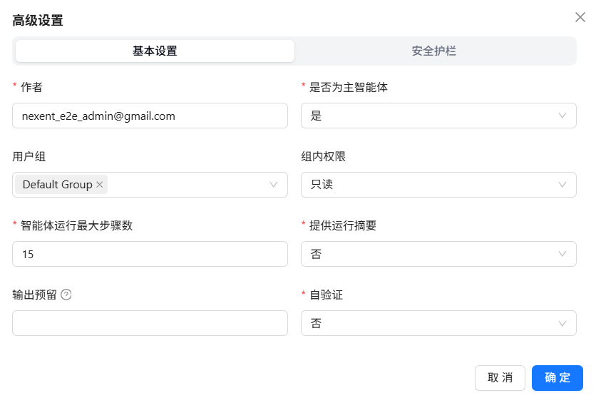
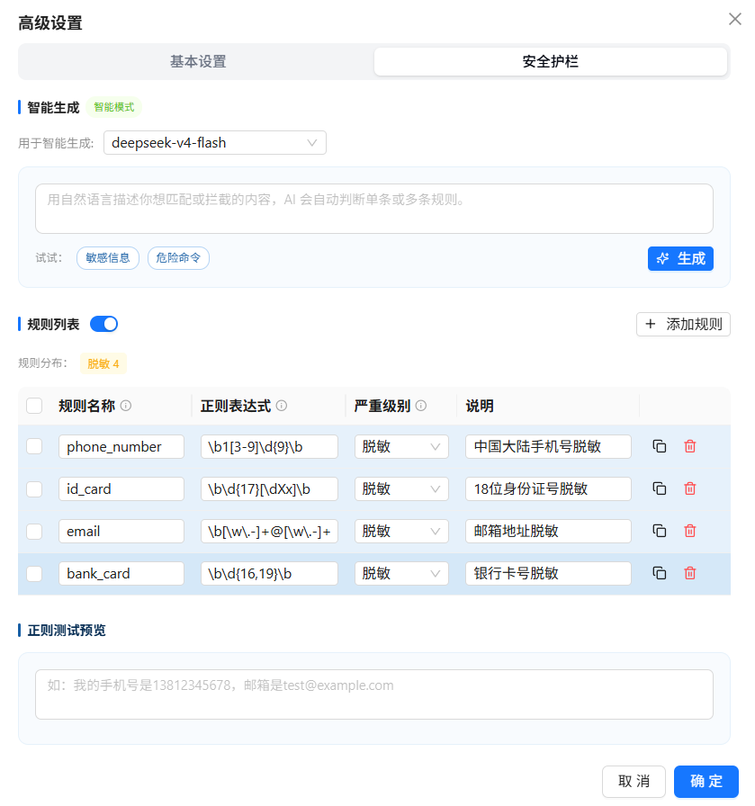

# Agent Development

In the Agent Development page, you can create, configure, and manage agents. Agents are the core feature of Nexent—they can understand your needs and perform corresponding tasks.

## 🔧 Create an Agent

On the Agent Management tab, click **New** to create a blank agent. Click **Exit Create** to leave creation mode.
If you have an existing agent configuration, you can also import it:

1. Click **Import**.
2. In the file selection dialog, select an agent configuration file in JSON or ZIP format.
3. Click "Open"; the system will validate the file format and content, and display the imported agent information




> ⚠️ **Note:** If you import an agent with a duplicate name, a prompt dialog will appear. You can choose:
>
> - **Import anyway**: Keep the duplicate name; the imported agent will be in an unavailable state and requires manual modification of the Agent name and variable name before it can be used
> - **Regenerate and import**: The system will call the LLM to rename the Agent, which will consume a certain amount of model tokens and may take longer

> 📌 **Important:** For agents created via import, if their tools include `knowledge_base_search` or other knowledge base search tools, these tools will only search **knowledge bases that the currently logged-in user is allowed to access in this environment**. The original knowledge base configuration in the exported agent will _not_ be automatically inherited, so actual search results and answer quality may differ from what the original author observed.

<div style="display: flex; justify-content: left;">
  
</div>

## 👥 Configure Collaborative Agents/Tools

You can configure other collaborative agents for your created agent, as well as assign available tools to empower the agent to complete complex tasks.

### 🤝 Collaborative Agents

Collaborative agents help the current agent complete complex tasks. The sources of collaborative agents are divided into two categories:

- **Internal Agents**: Published agents on the platform
- **External A2A Agents**: Third-party agents discovered through the A2A protocol

1. Click the plus sign under the "Collaborative Agent" tab to open the selectable agent list
2. The agent list is divided into two tabs: "Internal Agent" and "External A2A Agent". You can choose based on your needs
3. Select the agent you want to add from the dropdown list
4. Multiple collaborative agents can be selected
5. Click × to remove an agent from the selection

<div style="display: flex; justify-content: left;">
  
</div>

#### 🌐 Add External A2A Agents

Nexent supports communication with third-party agents through the A2A protocol. You can discover external A2A agents in the following two ways:

##### Discover Agent via URL

If you know the Agent Card address of the target agent, you can use the URL discovery method:

<div style="display: flex; justify-content: left;">
  
</div>

1. In the External A2A Agent list, click the "Add External Agent" button
2. Select the "URL Discovery" tab
3. Fill in the Agent Card URL address, for example: `https://example.com/.well-known/agent.json`
4. If the target Agent Card requires authentication, enter a JSON object in "Custom Request Headers", for example: `{"Authorization": "Bearer <token>"}`
5. Click the "Discover" button; the system will automatically retrieve the agent's related information
6. After successful discovery, you can view the agent's name, description, capabilities and other information
7. Click "Add to List" to complete the addition

> 💡 **Tip**: Custom request headers are saved with the external agent and used only to retrieve and refresh its Agent Card. They are never used for agent calls. When rediscovering the same URL, leaving this field empty keeps the current configuration; entering `{}` clears it.

> 💡 **Tip**: The Agent Card is an Agent description file that complies with the A2A 1.0 specification, containing the agent's name, description, calling address, capabilities and other information.

##### Discover Agent via Nacos

If your agent is registered with the Nacos service discovery platform, you can use the Nacos discovery method:

<div style="display: flex; justify-content: left;">
  
</div>

1. In the External A2A Agent list, click the "Add External Agent" button
2. Select the "Nacos Discovery" tab
3. For first-time use, you need to configure the Nacos connection information:
   - **Nacos Server Address**: Fill in the Nacos server address, such as `http://127.0.0.1:8848`
   - **Namespace ID**: Fill in the Nacos namespace ID (optional)
   - **Group Name**: Fill in the service group name, default is `DEFAULT_GROUP`
   - **Username/Password**: Fill in the Nacos access credentials (optional)
4. Click "Save Configuration" to save the Nacos connection information
5. Fill in the Agent service name to scan
6. Click the "Scan" button; the system will obtain matching Agent information from Nacos
7. The scan results will list all matching Agents. You can select the agents you need and add them to the list

> ⚠️ **Note**: Make sure the Nacos service is running properly and the target Agent is correctly registered with Nacos.

##### Manage Discovered External Agents

In the External A2A Agent list, you can view and manage all discovered external agents:

<div style="display: flex; justify-content: left;">
  
</div>

1. **View Agent Details**: Click on the agent card to view its complete information, including name, description, URL, capability list, etc.
2. **Test Agent**: Click the "Test" button to send a test message to the agent and verify if it is working properly
3. **Chat with Agent**: Click the "Chat" button to open a chat window and interact with the agent in real time
4. **Configure Calling Protocol**: Click the "Protocol Configuration" button to select the calling protocol for this agent:
   - **HTTP + JSON**: Use REST API style calls
   - **JSON-RPC**: Use JSON-RPC protocol calls
5. **Configure Call Authentication**: If the Agent Card declares `securitySchemes` and `securityRequirements`, click "Agent Authentication" and enter the required values. Nexent places each value in the header, query string, or cookie specified by the Card; fields in the same requirement must all be configured.
6. **Refresh Agent Information**: If the agent information changes, click the "Refresh" button to re-fetch the latest Agent Card
7. **Remove Agent**: Click the "Remove" button to delete the agent from the discovered list

> 💡 **Use Cases**:
>
> - Quickly integrate known third-party agent services through URL discovery
> - Batch integrate all agents from the same service registry through Nacos discovery
> - Configure protocols to meet the requirements of different agent service providers

###### Integrate [DataAgent](https://gitcode.com/datagallery/dataagent) A2A Agent via URL

1. Refer to the [DataAgent documentation](https://gitcode.com/datagallery/dataagent#%F0%9F%8C%90-a2a-10-%E6%9C%8D%E5%8A%A1%E6%A8%A1%E5%BC%8F) and start DataAgent in A2A service mode.
   > Nexent does not currently support agents that require authentication. Do not set `auth-token` when starting DataAgent.

<div style="display: flex; justify-content: left;">
  
</div>

2. Refer to [Discover Agent via URL](#discover-agent-via-url) to integrate the agent. The URL is `http://<IP>:9999/.well-known/agent-card.json`.
3. Refer to [Manage Discovered External Agents](#manage-discovered-external-agents) to configure the invocation protocol, and select HTTP + JSON for integration.

### 🛠️ Select Agent Tools or Skills

Agents can use tools and skills to complete tasks, including local capabilities such as knowledge base search, file parsing, image parsing, email, and file management. You can also integrate third-party or custom MCP tools and skills.

1. On the "Select Tools" tab, click "Refresh Tools" to update the available tool list
2. Click **Select Tools** or **Select Skills** to browse the available tools or skills by tag
3. Click ⚙️ to view the tool or skill description and configure its parameters
4. Select the tool or skill. You can remove it later from the selected tools or selected skills area
   - If the tool has required parameters that are not configured, a popup will appear to guide you through parameter configuration
   - If all required parameters are already configured, the tool will be selected directly


> 💡 **Tips**：
>
> 1. Please select the `knowledge_base_search` tool to enable the knowledge base search function.
> 2. Please select the `analyze_text_file` tool to enable the parsing function for document and text files.
> 3. Please select the `analyze_image` tool to enable the parsing function for image files.
>
> ⚠️ **Note:** Before using `knowledge_base_search`, create a knowledge base and ensure that **the embedding model used to create it** matches the currently active embedding model. Otherwise, retrieval may fail or return inaccurate results.
>
> 📚 Want to learn about all the built-in local tools available in the system? Please refer to [Local Tools Overview](../local-tools/index.md).
> 📚 Want to learn more about skills? Please refer to [Skill Management](../resource-repository/skill-repository.md).

### 🔌 Add MCP Tools

On the "Select Agent Tools" tab, click "MCP Config" to configure MCP servers in the popup and view configured servers.

You can add MCP services to Nexent in the following two ways:

**1️⃣ Add MCP Service via URL**

🔔 This method is suitable for independently deployed MCP services (supports SSE and Streamable HTTP protocols):

> 1.  In the **Add MCP Server** section at the top of the interface, fill in **Server name** and **Server URL**
>
> ⚠️ **Note:** The server name must contain only English letters or digits; spaces, underscores, and other characters are not allowed.
>
> 2.  Click the **+ Add** button on the right to complete adding a single service

**2️⃣ Add Containerized MCP Service via JSON Configuration**

🔔 This method is suitable for containerized MCP services deployed via npx:

> 1.  In the **Add Containerized MCP Service** input box, fill in a JSON configuration that matches the example format:
>
> ```json
> {
>   "mcpServers": {
>     "service-name": {
>       "args": ["mcp-package-name@version", "additional-parameters"],
>       "command": "npx"
>     }
>   }
> }
> ```
>
> 2.  In the **Port** input box below, enter the port number corresponding to the containerized service
> 3.  Click the **+ Add** button on the right to complete adding the containerized service

<div style="display: flex; justify-content: left;">
  
</div>

Many third-party services such as [ModelScope](https://www.modelscope.cn/mcp) provide MCP services, which you can quickly integrate and use.
You can also develop your own MCP services and connect them to Nexent; see [MCP Tool Development](../../backend/tools/mcp).

**3️⃣ Convert Stock API to MCP Service**

🔔 This method is suitable for quickly converting existing REST API endpoints into MCP tools without additional development, allowing agents to call existing API capabilities:

> 1.  In the MCP Config module, select **"API to MCP"** as the access type
> 2.  Fill in the API basic information in the input box below:
>
> - **Service Name**: Display name for the MCP service
> - **OpenAPI JSON**: OpenAPI 3.x specification in JSON format
> - **Base Service URL**: Base address of the API service (supports http/https)
>
> 3.  Click the **+ Add** button in the lower right corner to complete the MCP service conversion

<div style="display: flex; justify-content: left;">
  
</div>

> 4.  After conversion, you can view all externally converted MCP tools in the **Outer APIs** tab

<div style="display: flex; justify-content: left;">
  
</div>


> 💡 **Use Cases**:
>
> - Quickly integrate internal enterprise REST API endpoints
> - Convert third-party service HTTP APIs into MCP tools
> - Generate tools directly from OpenAPI specifications without writing MCP Server code

### ⚙️ Custom Tools

You can refer to the following guides to develop your own tools and integrate them into Nexent to enrich agent capabilities:

- [LangChain Tools Guide](../../backend/tools/langchain)
- [MCP Tool Development](../../backend/tools/mcp)
- [SDK Tool Documentation](../../sdk/core/tools.md)

### 🔌 Create or Import Skills

In the agent's advanced configuration, switch to the **Select Skills** tab and click **Build Skill**. You can create a skill through an interactive conversation or install one from a file. A successfully created skill is added to the list available to the current user, but it is **not automatically associated with the current agent**. You must select the skill and save the agent configuration afterward.

#### Create a Skill Interactively (NL2SKILL)

Interactive creation is suitable for building a skill from a natural-language requirement:

1. Click **Build Skill**, then select the **Interactive Creation** tab.
2. In the conversation area on the left, describe the skill's purpose, execution steps, inputs, outputs, and constraints. For example: "Create a skill that reads a CSV file and produces a data quality report."
3. The system streams a draft skill. You can stop generation at any time or continue the conversation to add requirements and revise the existing draft.
4. Review and edit the skill information and files in the draft area on the right:
   - **Skill Name:** Required and must be unique.
   - **Skill Description:** Required; explains the skill's purpose and applicable scenarios.
   - **Tags:** Add up to five tags, with no more than 20 characters per tag, to make the skill easier to search and filter.
   - **User Groups and Group Permissions:** Configure skill visibility and editing permissions as needed. These settings are shown or editable only when the current account has the required permissions.
   - **Skill Files:** `SKILL.md` is the main skill file and cannot be renamed or deleted. You can add, edit, rename, or delete scripts, assets, and other supporting files.
5. After reviewing the draft, click **Create**. If the skill name already exists, change it and try again.

#### Install a Skill from a File

Use the **Install** tab to import a prepared skill file. Click the upload area to select a file, or drag a file into it. Only one file can be uploaded at a time, in one of the following formats:

| File Format | Use Case | Requirements |
| --- | --- | --- |
| `.md` | A single-file skill containing only its main instructions | The file must be a complete `SKILL.md` with `name` and `description` in its YAML Front Matter |
| `.zip` | A multi-file skill containing scripts, assets, or other supporting files | The archive must contain `SKILL.md`, either at its root or in a subdirectory; other files are imported with the skill |

A basic `SKILL.md` looks like this:

```markdown
---
name: csv-report
description: Analyze CSV files and generate data quality reports
tags:
  - data-analysis
---

# CSV Data Quality Report

After the user provides a CSV file, check missing values, duplicate records, and field types, then produce a structured report.
```

After upload, the system reads the skill name and description from `SKILL.md` and displays the parsed result. Confirm the information and click **Create** to complete the installation.

> ⚠️ **Import Restrictions:**
>
> - `SKILL.md` must contain valid YAML Front Matter with both `name` and `description`. Missing either field causes the import to fail.
> - `SKILL.md` must use UTF-8 encoding.
> - Importing does not overwrite an existing skill with the same name. Change `name` in `SKILL.md`, then upload the file again.
> - For a multi-file skill, compress the skill directory as a `.zip` file and ensure the archive contains `SKILL.md`.

#### Associate the New Skill with the Agent

After creating or installing a skill, associate it with the current agent as follows:

1. If the list has not updated, click **Refresh Skills**.
2. Click **Select Skills**, then find and select the new skill by name, description, or tag.
3. If the skill has parameters that require values, click ⚙️ to configure them.
4. Return to the agent configuration page and save the configuration. The agent can use the skill only after these steps are complete.

For complete instructions on viewing, editing, sharing, and deleting skills, see [Skill Management](../resource-repository/skill-repository.md).

### 🧪 Tool Testing

Nexent provides a "Tool Testing" capability for all types of tools—whether they are built-in tools, externally integrated MCP tools, or custom-developed tools. If you are unsure about a tool's effectiveness when creating an agent, you can use the testing feature to verify that the tool works as expected.

1. Click the gear icon ⚙️ next to the tool to open the tool's detailed configuration popup
2. First, ensure that all required parameters (marked with red asterisks) are configured
3. Click the "Test Tool" button in the lower left corner of the popup
4. A new test panel will appear on the right side
5. Enter the tool's input parameters in the test panel. For example:
   - When testing the local knowledge base search tool `knowledge_base_search`, you need to enter:
     - The test `query`, such as "benefits of vitamin C"
     - The search `search_mode` (default is `hybrid`)
     - The target index list `index_names`, such as `["Medical", "Vitamin Encyclopedia"]`
     - If `index_names` is not entered, it will default to searching all knowledge bases selected on the knowledge base page
6. After entering the parameters, click "Execute Test" to start the test and view the test results below

<div style="display: flex; justify-content: left;">
  
</div>

## 📝 Describe Business Logic

### ✍️ Describe How the Agent Should Work

Based on the selected collaborative agents and tools, you can now describe in simple language how you expect this agent to work. Nexent will automatically generate the agent name, description, and prompts based on your configuration and description.

1. In the editor under "Describe how should this agent work", enter a brief description, such as "You are a professional knowledge Q&A assistant with local knowledge search and online search capabilities, synthesizing information to answer user questions"
2. Select a model (choose a smarter model when generating prompts to optimize response logic), click the "Generate Agent" button, and Nexent will generate detailed agent content for you, including basic information and prompts (role, usage requirements, examples)
3. You can edit and fine-tune the auto-generated content (including agent information and prompts) in the Agent Detail Content below

#### 📋 Agent Basic Information Configuration

In the basic information section, if you are not satisfied of the auto-generated content, you can configure the following fields by your own:

| Field | Description |
| --- | --- |
| **Agent Name** | The display name shown in the interface and used to identify the agent. |
| **Agent Variable Name** | The internal identifier used to reference the agent. It can contain only letters, numbers, and underscores, and must begin with a letter or underscore. |
| **Large Language Model** | The model the agent uses for reasoning, tool calls, and response generation. |
| **Agent Description** | Describes the agent's purpose and capabilities. |

> 💡 **Usage Suggestions**:
>
> - Use meaningful English variable names that are easy for the model to understand, such as `code_assistant` or `data_analyst`.



#### ⚙️ Advanced Settings

Click **Advanced Settings** on the right side of **Agent Details** to further configure the agent's runtime behavior, permissions, self-verification, and safety guardrails. Advanced Settings contains **Basic Settings** and **Safety Guardrails** tabs. After making changes, click **OK** in the dialog and then save the agent for the settings to take effect.



##### Basic Settings

| Setting | Default | Description |
| --- | --- | --- |
| **Author** | Current user | The author name of the agent. |
| **Main Agent** | Yes | Controls whether the agent is displayed as a main agent that can be used for independent conversations. If set to **No**, the agent is better suited for use as a collaborative agent and does not appear in the list of main agents available for starting a conversation, even after publication. |
| **User Groups** | None | One or more user groups that the agent belongs to, used for organization and permission management. Only users with the required permissions can modify this setting. |
| **Group Permission** | Read-only | Controls access for users in the same group: **Editable** allows group members to view and edit; **Read-only** allows viewing only; **Private** limits access to the creator and administrators. |
| **Maximum Agent Run Steps** | 15 | The maximum number of think-act cycles allowed in a single run. It must be an integer of at least 1. When the limit is reached, the system stops further execution and summarizes the completed work. More steps support more complex tasks but increase time and resource consumption. |
| **Provide Run Summary** | No | Applies only when the agent is invoked by a main agent as a collaborative agent. **Yes** appends a summary of the work process to the final result; **No** returns only the final result and reduces context usage by the main agent. |
| **Output Reserve** | Model default | Limits the maximum number of output tokens per response and reserves that space in the model's context window. A larger value allows longer responses but leaves less room for input and history and triggers context compression earlier. A smaller value preserves more input but may truncate the response. The value must be a positive integer and cannot exceed the selected model's maximum output tokens. |
| **Self-Verification** | No | When enabled, the system checks key execution events and the final response. If it finds issues with tool calls, retrieval evidence, code execution, or answer quality, it asks the agent to correct or retry. If the final response repeatedly fails verification, the system returns a controlled explanation instead of an unverified definitive conclusion. |

> 💡 **Configuration Tips:**
>
> - Use 3–5 maximum steps for simple Q&A and 10–20 for complex retrieval or reasoning tasks, then adjust based on debugging results.
> - Enable **Provide Run Summary** only when the main agent needs details about the collaborative agent's execution. Otherwise, leave it disabled to save context.
> - Normally, leave **Output Reserve** empty to use the model default. Adjust it only when responses are frequently truncated or when more space is needed for conversation history.

##### 🚧 Safety Guardrails

Safety guardrails use sequential regular-expression rules to inspect content sent to the model and data involved in tool calls. Guardrails are disabled by default and operate independently of **Self-Verification**. To enable them, turn on the switch beside the rule list and configure at least one valid rule. Rules are evaluated in list order, and the first matching rule applies to a given piece of content.



Each rule contains the following settings:

| Setting | Description |
| --- | --- |
| **Rule Name** | A unique identifier for the rule. The interface warns about duplicate names; use a name that clearly describes the detection target. |
| **Regular Expression** | A pattern written using Python `re` syntax. Matching is case-insensitive by default at runtime; rules with invalid syntax are excluded from runtime checks. |
| **Severity** | Determines the action after a match: **Block**, **Redact**, or **Allow**. New rules default to **Block**. |
| **Description** | An optional explanation of the rule's purpose for maintenance and review. |

The severity levels behave as follows at each inspection point:

| Severity | Latest User Input | Historical Messages | Tool Inputs | Tool Outputs |
| --- | --- | --- | --- | --- |
| **Block** | Stop the run and return a refusal explanation | Downgrade to redaction before sending to the model | Prevent the tool call | Because the tool has already run, downgrade to redaction |
| **Redact** | Replace matched content with `***` and continue | Replace matched content with `***` and continue | Replace matched string arguments with `***` before calling the tool | Replace matched content with `***` before adding it to the agent context |
| **Allow** | Continue without modifying the content | Continue without modifying the content | Call the tool without modifying its arguments | Continue without modifying the output |

Safety guardrails also provide the following supporting capabilities:

- **AI Generate:** Select a model and describe in natural language what should be matched or intercepted. The system determines whether to generate one candidate expression or multiple rules; confirm the candidate or select the rules before importing them into the list.
- **Rule Management:** Add, edit, copy, delete, or batch-delete rules manually, and view the distribution of Block, Redact, and Allow rules.
- **Regex Test Preview:** Paste sample text to preview matched text, rule names, and match counts in real time. The preview validates matching only; it does not perform blocking or redaction actions.

> ⚠️ **Note:** Safety guardrails perform regular-expression-based content screening and are not a complete semantic safety review. AI-generated rules can also produce false positives or false negatives. Test both normal and risky samples in **Regex Test Preview** before saving the configuration.

### 🐛 Debug and Save

After completing the initial agent configuration, you can debug the agent and fine-tune the prompts based on the debugging results to continuously improve agent performance.

1. Click the "Debug" button in the lower right corner of the page to open the agent debug page
2. Test conversations with the agent and observe its responses and behavior
3. Review conversation performance and error messages, and optimize the agent prompts based on the test results

After successful debugging, click the "Save" button in the lower right corner, and the agent will be saved and appear in the agent list.

## 📋 Version Management

Nexent supports agent version management. You can save different versions of agent configurations during the debugging process.

After verifying the agent configuration, click **Publish** to publish it. The agent then becomes visible in Agent Repository and Start Chat, and its version history can be managed.

Click the version comparison button in the lower-right corner of **Version Management** to review a historical version and compare its Q&A performance with the latest version.


To roll back to another version, open the menu on the right side of that version and click **Rollback**.


### 🚀 Publish as A2A Agent

Nexent supports exposing published agents as A2A Agents for external systems to call. When publishing a version, you can check the "Publish as A2A Agent" option to register the current agent as an A2A 1.0 compliant Agent.

<div style="display: flex; justify-content: left;">
  
</div>

After successful publishing, the system will display the A2A Agent's call information:

<div style="display: flex; justify-content: left;">
  
</div>

| Field                 | Description                                                                                |
| --------------------- | ------------------------------------------------------------------------------------------ |
| **Endpoint ID**       | Unique identifier for the A2A Agent                                                        |
| **Agent Card URL**    | Agent discovery endpoint; external systems use this address to retrieve Agent descriptions |
| **Protocol Version**  | A2A protocol version; currently 1.0                                                        |
| **REST Endpoints**    | REST-style API endpoints                                                                   |
| **JSON-RPC Endpoint** | JSON-RPC 2.0 protocol calling endpoint                                                     |

#### Calling Methods

The published A2A Agent supports the following two calling protocols:

##### REST API

```bash
# Get Agent Card (for Agent discovery)
GET /nb/a2a/{endpoint_id}/.well-known/agent-card.json

# Send synchronous message
POST /nb/a2a/{endpoint_id}/message:send
Content-Type: application/json

{
  "message": {
    "role": "user",
    "content": "Please help me complete a task"
  }
}

# Send streaming message (SSE)
POST /nb/a2a/{endpoint_id}/message:stream
Content-Type: application/json

{
  "message": {
    "role": "user",
    "content": "Please help me complete a task"
  }
}

# Get task status
GET /nb/a2a/{endpoint_id}/tasks/{task_id}
```

##### JSON-RPC 2.0

```bash
POST /nb/a2a/{endpoint_id}/v1
Content-Type: application/json

# Send synchronous message
{
  "jsonrpc": "2.0",
  "method": "SendMessage",
  "params": {
    "message": {
      "role": "user",
      "content": "Please help me complete a task"
    }
  },
  "id": 1
}

# Send streaming message
{
  "jsonrpc": "2.0",
  "method": "SendStreamingMessage",
  "params": {
    "message": {
      "role": "user",
      "content": "Please help me complete a task"
    }
  },
  "id": 2
}

# Get task status
{
  "jsonrpc": "2.0",
  "method": "GetTask",
  "params": {
    "taskId": "task_abc123"
  },
  "id": 3
}
```

> 💡 **Tips**:
>
> - For local development, replace the `/nb/a2a` prefix with `http://localhost:5013/nb/a2a` (use `http://localhost:30013/nb/a2a` if running on k8s)
> - For production environments, replace the prefix with your server domain name or public IP address

> ⚠️ **Notes**:
>
> - Calling A2A Agents requires carrying valid authentication information in the request headers
> - Agent Card information is cached with a refresh interval of 1 hour
> - If you need to update Agent information, you need to republish the agent version

When an agent is published as an A2A-compliant Agent, click the leftmost icon in the agent list to view its detailed calling information.


## 🔧 Manage the Agent List

Click **Select Agent** to browse the complete list of agents you can edit in the current environment. Use the search box at the top to locate an agent.


The icons on the right side of each agent represent the available management actions. From left to right, they are:

### 📋 Copy

Create an identical clone of an agent for version backups or parallel testing.

### 🔗 View Call Relationships

View the collaborative agents/tools used by the agent, displayed in a tree diagram to clearly see the agent call relationships.

<div style="display: flex; justify-content: left;">
  
</div>

### 📤 Export

Export a successfully debugged agent as a JSON or ZIP file, which can later be imported to create a copy. Complex agents that include skills are exported as ZIP archives by default.

### 🗑️ Delete

Permanently delete the agent from the local environment.

## 🚀 Next Steps

After completing agent development, you can:

1. Manage and publish your agents, or discover agents from other developers, in **[Agent Repository](../agent-development.md)**
2. Interact with agents in **[Start Chat](../start-chat.md)**
3. Configure **[Memory Management](./memory-configuration.md)** to enhance the agent's personalization capabilities

If you encounter any issues during agent development, please refer to our **[FAQ](../../quick-start/faq.md)** or ask for support in [GitHub Discussions](https://github.com/ModelEngine-Group/nexent/discussions).
