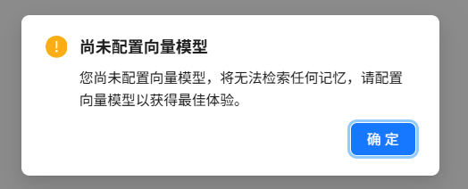

# Memory Configuration

Nexent's memory capability preserves reusable information across multiple turns and conversations. The current memory system uses a **three-level Tenant, User, and Agent architecture**: the Tenant and User levels store long-term memories, while the Agent level stores short-term memories generated through interactions between a specific user and a specific agent.

When memory is enabled, the system loads long-term memories and retrieves relevant Agent short-term memories before the agent runs. Before producing its final response, the agent also determines whether the current conversation contains new information worth saving.

## 🎯 How It Works

During a normal conversation, memory works as follows:

1. Load the current tenant's Tenant long-term memories and the current user's User long-term memories.
2. Use the user's latest question to search the short-term memories associated with the current user and agent.
3. Add the available long-term memories and retrieved short-term memories to the agent context.
4. Generate a response using the memories, current question, tool results, and conversation history.
5. Before returning the final response, determine whether the conversation introduced new user preferences, task objectives, action plans, recent progress, or corrective reflections. If so, summarize them as concise Agent short-term memories.

Memory operations are performed through built-in tools. You can inspect tool execution status to confirm the memory-loading trace. If memory retrieval fails, the system skips memory and continues the current task so that a memory service issue does not interrupt the entire conversation.

> 💡 **Note:** Memory retrieval and writing are disabled in agent debug mode to prevent test data from affecting production memories. Use **Start Chat** to verify cross-conversation memory behavior.

## ⚙️ Open Memory Configuration

1. Click **Memory Configuration** in the left navigation bar.
2. The page contains four tabs: **Base Settings**, **Tenant**, **User**, and **Agent**.
3. The number beside each tab indicates how many memory records are currently loaded for that level.

### Base Settings

Base Settings currently provides a master switch for memory capability.

| Setting | Default | Description |
| --- | --- | --- |
| **Memory Capability** | Enabled | When enabled, normal conversations load, retrieve, and write memories. Disabling it stops agents from using memory but does not delete existing records. |

Changes to the switch are saved immediately. If saving fails, the page restores the previous state and displays an error message.

## 📚 Three-Level Memory Architecture

The current system uses only the following three memory levels:

| Level | Visibility and Scope | Primary Source | How It Is Used |
| --- | --- | --- | --- |
| **Tenant** | Shared within the current tenant | Manually maintained by authorized users | Supplied to agents as organization-level long-term context |
| **User** | Visible only to the current user and available to that user's agents | Manually maintained by the current user | Supplied to agents as user-level long-term context |
| **Agent** | Isolated to the current user and a specific agent | Automatically summarized by the agent during conversations | Relevant content is selected through vector retrieval and added to the context |

### Tenant Memory

Tenant memory stores stable information that applies across the organization, such as:

- Company terminology and standardized wording
- Common working conventions and process principles
- Organization-level preferences or constraints
- Facts that multiple users and agents need to reference

Agents do not write Tenant memories automatically. Only users with permission to create Tenant memories can see the **New Memory** button; these memories are typically maintained by tenant administrators.

### User Memory

User memory belongs only to the current user and is suitable for stable personal information that should be reused across agents, such as:

- Preferred language, format, and writing style
- Long-term working habits
- Ongoing project context
- Personal requirements that all agents should follow

User memories are created and maintained manually by the current user. They are not shared with other users in the tenant.

### Agent Memory

Agent memories are generated automatically during production conversations and are bound to both the current user and current agent. They may store:

- Preferences the user expresses to that agent
- Current task objectives
- Action plans and recent progress
- Reflections derived from user feedback, errors, or failed results

Agent memories for the same user-agent pair can be recalled across conversations, but they are not automatically shared across users or agents. Main agents and collaborative agents also maintain separate Agent memories.

Before saving a memory, the agent must evaluate, summarize, and deduplicate it into a concise, reusable entry. Full conversations, temporary calculations, intermediate noise, unverified assumptions, duplicate content, sensitive credentials, and information the user explicitly asked to forget should not be written to memory. A single agent run can automatically save at most three Agent short-term memories.

> ⚠️ **Note:** The current version does not periodically promote Agent short-term memories to User long-term memories in the background.

## 🗂️ View and Filter Memories

The Tenant, User, and Agent tabs display memory records in tables, including memory content, type, status, and creation time.

All levels support:

- Searching by memory content
- Filtering by status
- Viewing the number of filtered results
- Paginated browsing with 10, 20, or 50 records per page

The Agent tab also supports:

- Filtering by agent, source conversation, or creation date range
- Viewing the agent name and source conversation
- Clicking the source conversation title to return to the conversation that generated the memory

### Memory Status

| Status | Description |
| --- | --- |
| **Active** | The memory can participate in long-term context loading or Agent short-term memory retrieval. |
| **Archived** | The memory remains in the list but is excluded from runtime loading and retrieval. |
| **Disabled** | The memory is temporarily unavailable. This status can be set manually or caused by an Agent memory being incompatible with the current embedding model. |

## ✍️ Create, Edit, and Delete Memories

### Create a Long-Term Memory

The page only supports manually creating Tenant or User long-term memories. Agent short-term memories are generated while agents run, so the Agent tab does not provide a **New Memory** button.

1. Open the Tenant or User tab.
2. Click **New Memory** in the upper-right corner.
3. Enter the content to retain, up to 500 characters.
4. Click **Create Memory**.

Manually created records default to the **Long-term Memory** type and **Active** status.

### Edit a Memory

1. Click **Edit** on the right side of the target record.
2. Modify the memory content or status.
3. Click **Save Changes**.

Edited content must still remain within the 500-character limit. The current page does not allow changing a record's memory level or type through editing.

If an Agent memory is incompatible with the current embedding model, it appears as unavailable and cannot be edited, but it can still be deleted.

### Delete a Memory

Click **Delete** on the right side of a record, then select **Confirm Delete** in the confirmation dialog. The record will be removed from the page and excluded from subsequent memory loading and retrieval.

> ⚠️ **Note:** The page does not provide a restore option. Confirm that the memory is no longer needed before deleting it.

## 🔍 Memory Retrieval and Context Usage

Different levels are used differently:

- **Tenant / User long-term memories:** Active long-term memories are read from storage and supplied directly to the agent as persistent context, without semantic-similarity filtering.
- **Agent short-term memories:** The latest user question is used for vector retrieval. The results are then filtered through relevance fusion, time decay, similarity deduplication, and the context budget before the most useful entries are supplied to the agent.

Tenant and User memories should therefore remain concise and stable, because excessive content directly consumes model context. Agent memories can accumulate gradually through interactions; the system prioritizes content that is more relevant to the current question, more recent, and non-duplicative.

## 🧩 Embedding Models and Agent Memory

Generating and retrieving Agent short-term memories depends on the tenant's currently configured embedding model. When opening **Memory Configuration** or **Start Chat**, the system displays a prompt if the tenant has not configured an embedding model.

Without an available embedding model:

- Tenant and User long-term memories remain stored and are managed as long-term context.
- Agent short-term memories cannot be generated or retrieved normally.

After switching embedding models, Agent memories indexed with the previous model may be incompatible with the current index. The page automatically synchronizes their status when loading records:

| Embedding Compatibility | Synchronized Status |
| --- | --- |
| Incompatible | Disabled |
| Compatible | Active |

If you switch back to an embedding model compatible with the original records, disabled Agent memories become **Active** again.

## 💡 Usage Tips

### Write High-Quality Memories

Each memory should express one clear fact that can be reused over time.

✅ `The user prefers technical proposals to present the conclusion before the risks.`

❌ Not recommended: `The user likes concise answers, often works at night, manages several projects, and wants everything presented in tables.`

Follow these guidelines:

1. **Keep memories atomic:** Each entry should describe only one preference, fact, objective, or piece of progress.
2. **Avoid temporary information:** Do not save one-off calculations or short-lived irrelevant details.
3. **Maintain memories regularly:** Archive or delete outdated content.
4. **Control the number of long-term memories:** Tenant and User memories are supplied as persistent context, so avoid verbose, duplicate, or contradictory entries.
5. **Protect privacy:** Do not store passwords, access tokens, keys, or unnecessary sensitive personal information.

## 🚀 Next Steps

After configuring memory, you can:

1. Start multiple conversations with the same agent in **[Start Chat](../start-chat)** to verify cross-conversation memory.
2. Check the embedding model in **[Model Configuration](./model-configuration.md)**.
3. Continue creating and adjusting agents in **[Agent Configuration](./agent-configuration.md)**.

If you encounter any issues, refer to the **[FAQ](../../quick-start/faq.md)** or visit [GitHub Discussions](https://github.com/ModelEngine-Group/nexent/discussions) for support.
