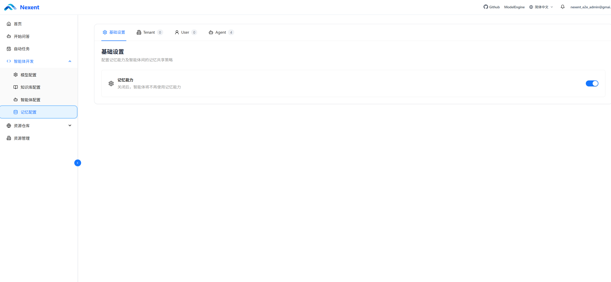
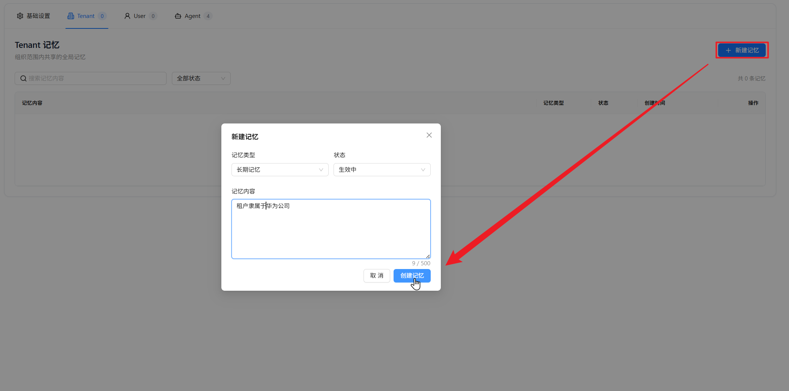
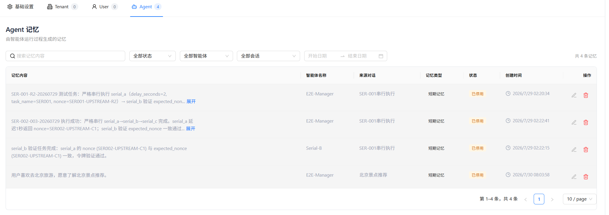

# 记忆配置

Nexent 的记忆功能用于在多轮、跨会话交互中保留可复用的信息。当前记忆系统采用 **Tenant、User、Agent 三层架构**：Tenant 和 User 层保存长期记忆，Agent 层保存由特定用户与特定智能体交互产生的短期记忆。

开启记忆后，系统会在智能体运行前加载长期记忆并检索相关的 Agent 短期记忆；在运行结束前，智能体还会判断本轮对话是否产生了值得保存的新信息。

## 🎯 运作机制

在正常对话中，记忆功能按以下流程运行：

1. 加载当前租户的 Tenant 长期记忆和当前用户的 User 长期记忆。
2. 使用用户本轮最新问题，在当前用户与当前智能体的 Agent 短期记忆中执行一次相关性检索。
3. 将可用的长期记忆和检索到的短期记忆加入智能体上下文。
4. 智能体结合记忆、当前问题、工具执行结果和历史对话生成回答。
5. 输出最终回答前，智能体判断是否出现了新的用户偏好、任务目标、行动计划、最新进展或纠错反思；有价值时，将其归纳为简洁的 Agent 短期记忆。

记忆通过内置工具执行，你可以通过检查工具运行状态来确认记忆载入的轨迹。若记忆检索失败，系统会跳过记忆并继续执行当前任务，避免因记忆服务异常中断整个对话。

> 💡 **说明**：智能体调试模式不会启用记忆检索或写入，避免调试数据影响正式记忆。请在“开始问答”中验证跨会话记忆效果。

## ⚙️ 进入记忆配置

1. 在左侧导航栏中点击“记忆配置”。
2. 进入页面后，可以看到“基础设置”“Tenant”“User”和“Agent”四个页签。
3. 页签名称旁的数字表示当前层级加载到的记忆条数。

### 基础设置

“基础设置”中目前提供“记忆能力”总开关。

| 配置项       | 默认值 | 说明                                                                                   |
| ------------ | ------ | -------------------------------------------------------------------------------------- |
| **记忆能力** | 开启   | 开启后，正常对话会加载、检索和写入记忆；关闭后，智能体不再使用记忆，但已有记录不会被删除。 |

开关修改后会立即保存。如果保存失败，页面会恢复为修改前的状态并显示错误提示。

## 📚 三层记忆架构

当前系统只使用以下三个记忆层级：

| 层级       | 可见与生效范围                         | 主要来源               | 使用方式                                         |
| ---------- | -------------------------------------- | ---------------------- | ------------------------------------------------ |
| **Tenant** | 当前租户内共享                         | 具有权限的用户手动维护 | 作为组织级长期上下文提供给智能体                 |
| **User**   | 仅当前用户可见，可供该用户的智能体使用 | 当前用户手动维护       | 作为用户级长期上下文提供给智能体                 |
| **Agent**  | 当前用户与指定智能体之间隔离           | 智能体在对话中自动归纳 | 根据当前问题执行向量检索，选择相关内容加入上下文 |

### Tenant 记忆

保存组织范围内稳定、通用的信息，例如：

- 企业术语和统一口径
- 通用工作规范和流程原则
- 组织级偏好或约束
- 需要被多个用户和智能体共同参考的事实

Tenant 记忆不会由智能体自动写入。只有具备 Tenant 记忆创建权限的用户才能看到“新建记忆”按钮，通常由租户管理员负责维护。

### User 记忆

只属于当前用户，适合保存跨智能体复用的稳定个人信息的记忆，例如：

- 常用语言、格式和表达偏好
- 长期有效的工作习惯
- 持续性项目背景
- 希望所有智能体遵循的个人要求

User 记忆由当前用户手动创建和维护。它不会与租户中的其他用户共享。

### Agent 记忆

Agent 记忆由智能体在正式对话中自动生成，并同时绑定当前用户和当前智能体。它将保存：

- 用户对该智能体表达的偏好
- 当前任务目标
- 行动计划和最新进展
- 根据用户反馈、报错或失败结果形成的反思总结

同一用户与同一智能体的 Agent 记忆可以跨会话召回，但不会在不同用户或不同智能体之间自动共享。主智能体和协作智能体也分别维护自己的 Agent 记忆。

系统要求智能体先判断、归纳并去重，再保存单条简洁、可复用的内容。整段对话、临时计算、中间噪声、未经验证的推测、重复内容、敏感密钥以及用户明确要求遗忘的信息不应写入记忆。单次智能体运行最多自动保存 3 条 Agent 短期记忆。

> ⚠️ **注意**：当前版本不会在后台定时将 Agent 短期记忆自动提升为 User 长期记忆。

## 🗂️ 查看和筛选记忆

Tenant、User 和 Agent 页签均以表格展示记忆记录，包括记忆内容、记忆类型、状态和创建时间。

所有层级都支持：

- 按记忆内容搜索
- 按状态筛选
- 查看当前筛选结果数量
- 分页浏览，每页可选择显示 10、20 或 50 条记录

Agent 页签还支持：

- 按智能体、来源对话或创建日期范围筛选
- 查看智能体名称和来源对话
- 点击来源对话标题，返回产生该记忆的历史对话

### 记忆状态

| 状态         | 说明                                                                                  |
| ------------ | ------------------------------------------------------------------------------------- |
| **生效中**   | 记忆可以参与长期上下文加载或 Agent 短期记忆检索。                                    |
| **已归档**   | 记忆仍保留在列表中，但不会参与智能体运行时的记忆加载和检索。                          |
| **已停用**   | 记忆暂时不可使用。可以由用户手动设置，也可能因 Agent 记忆与当前向量模型不兼容而产生。 |

## ✍️ 新建、编辑和删除记忆

### 新建长期记忆

页面仅支持手动新建 Tenant 或 User 长期记忆；Agent 短期记忆由智能体运行过程生成，Agent 页签不提供“新建记忆”按钮。

1. 进入 Tenant 或 User 页签。
2. 点击右上角“新建记忆”。
3. 输入需要长期保留的记忆内容，最多 500 个字符。
4. 点击“创建记忆”。

手动创建的记录默认为“长期记忆”和“生效中”状态。

### 编辑记忆

1. 在目标记录右侧点击“编辑”按钮。
2. 修改记忆内容或状态。
3. 点击“保存修改”。

编辑内容时仍需遵守 500 个字符的限制。当前页面不支持通过编辑操作改变一条记录所属的层级或记忆类型。

如果 Agent 记忆与当前向量模型不兼容，该记录会以不可用样式显示，并禁止编辑；仍可将其删除。

### 删除记忆

点击记录右侧的“删除”按钮，并在确认弹窗中选择“确认删除”。删除后该记录不会再出现在页面中，也不会参与后续记忆加载或检索。

> ⚠️ **注意**：页面不提供恢复入口，请在删除前确认该记忆不再需要。

## 🔍 记忆检索与上下文使用

不同层级采用不同的使用方式：

- **Tenant / User 长期记忆**：从记录库中读取生效中的长期记忆，直接作为长期上下文提供给智能体，不依赖语义相似度筛选。
- **Agent 短期记忆**：使用本轮最新问题进行向量检索，并经过相关性融合、时间衰减、相似内容去重和上下文预算筛选后，将最有用的结果提供给智能体。

这意味着 Tenant 和 User 记忆应保持精炼、稳定；内容过多会直接占用模型上下文。Agent 记忆则可以随交互逐步积累，系统会优先召回与当前问题更相关、更新且不重复的内容。

## 🧩 向量模型与 Agent 记忆

Agent 短期记忆的生成和检索依赖租户当前配置的向量模型。进入“记忆配置”或“开始问答”时，如果租户尚未配置向量模型，系统会弹出弹框提示用户。

未配置可用向量模型时：

- Tenant 和 User 长期记忆仍保存在记录库中，并按长期上下文方式管理。
- 无法正常生成或检索 Agent 短期记忆。

切换向量模型后，使用旧模型建立索引的 Agent 记忆可能与当前索引不兼容。页面加载记录时会自动同步状态：

| 向量兼容性 | 同步后状态 |
| ---------- | ---------- |
| 不兼容     | 已停用     |
| 兼容       | 生效中     |

如果切回与原记录兼容的向量模型，已停用的 Agent 记忆会重新变为“生效中”。

## 💡 使用建议

### 编写高质量记忆

每条记忆应尽量只表达一个明确、可长期复用的事实。

✅ `用户希望技术方案先给出结论，再说明风险。`

❌ 不推荐：`用户喜欢简洁回答、经常晚上工作、正在做多个项目，而且希望所有内容都用表格。`

建议遵循以下原则：

1. **保持原子性**：一条记忆只描述一个偏好、事实、目标或进展。
2. **避免临时信息**：一次性的计算结果和短期无关信息不应保存。
3. **定期维护**：对过期内容选择“已归档”或直接删除。
4. **控制长期记忆数量**：Tenant 和 User 记忆会作为长期上下文使用，应避免冗长、重复与前后矛盾。
5. **保护隐私**：不要保存密码、访问令牌、密钥或不必要的敏感个人信息。

## 🚀 下一步

配置好记忆后，您可以：

1. 在 **[开始问答](../start-chat)** 中使用同一智能体发起多次对话，验证跨会话记忆效果。
2. 在 **[模型配置](./model-configuration.md)** 中检查向量模型配置。
3. 在 **[智能体配置](./agent-configuration.md)** 中继续创建和调整智能体。

如果使用过程中遇到问题，请参考 **[常见问题](../../quick-start/faq.md)**，或前往 [GitHub Discussions](https://github.com/ModelEngine-Group/nexent/discussions) 获取支持。
